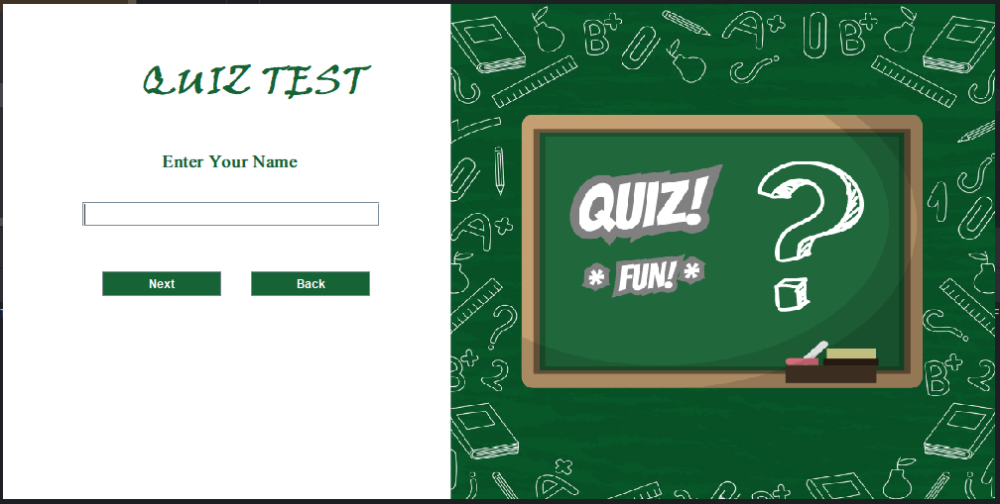
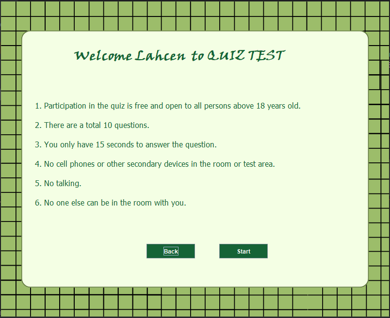
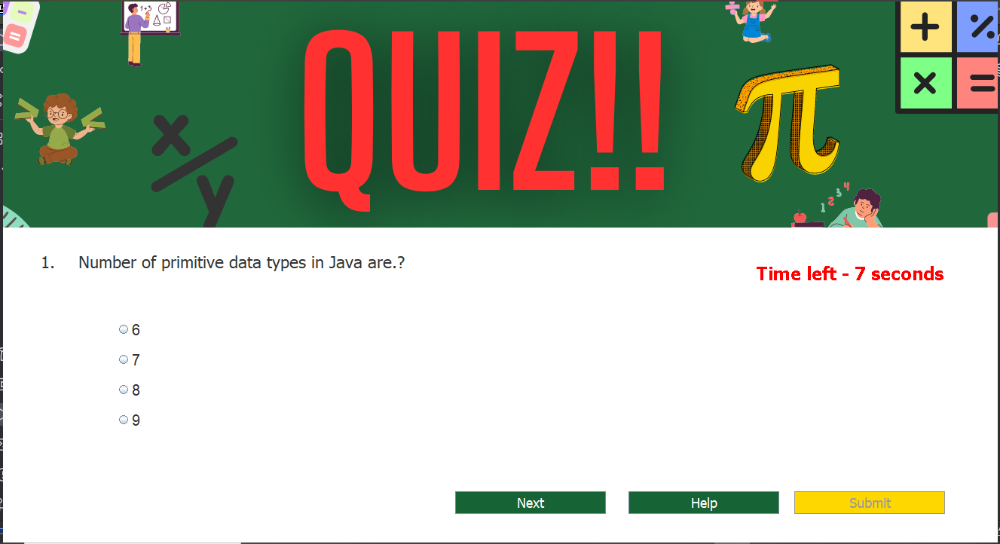
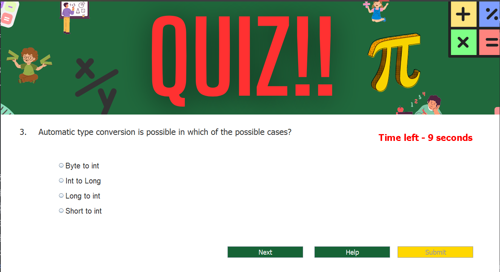
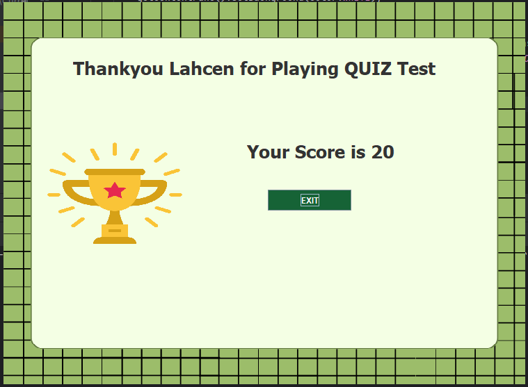

# 🎮 Quiz-App

A Java-based quiz application with a simple and interactive interface. The app lets users log in, review rules, answer a set of questions, and check their scores. Developed using **Java 17** and **Java Swing** for a rich user experience.

---

## 🌐 Personal Links
- [🌐 LinkedIn](https://www.linkedin.com/in/lahcenelorf/).
- [👨‍💻 Github](https://github.com/ELORF-Lahcen).

---

## 🔗 [technologies used]
<div align="center">
    
    
    
</div>

---

## 📌 Features

- 🖥️ **Login Screen**: Secure login process to start the quiz.
- 📜 **Rules Display**: View and agree to the quiz rules before starting.
- 🏆 **Quiz Questions**: Answer 10 questions within a 15-second limit for each.
- 🎯 **Score Display**: Check your score after completing the quiz.

---

## 🛠️ Tech Stack

- **Java 17** - Core programming language for the app.
- **Java Swing** - Used for building the GUI (Graphical User Interface).
- **HTML (for rules)** - Displaying formatted rules within the app.

---

### 🛠️ Setup Instructions

1. **Clone the repository**:
   ```bash
   git clone https://github.com/elorf-lahcen/Quiz-App.git

--- 

## 📂 Project Structure

```plaintext
Quiz-App/
├── .gitignore           # Git ignore file to exclude unnecessary files
├── Quiz-App.iml         # IntelliJ IDEA project file
├── README.md            # Project documentation
├── projectImages        # Project images
└── src/
    ├── icons/           # Folder for app icons
    └── quiz/app/
        ├── Login.java   # Login screen code
        ├── Quiz.java    # Main quiz logic
        ├── Rules.java   # Displaying rules to the user
        └── Score.java   # Logic for displaying score
```

--- 

## 📸 Screenshots

1- **Login Screen**
The user is prompted to log in before starting the quiz.


  
2- **Rules Screen**
Displays the rules of the quiz to ensure all participants understand the conditions.



3- **Quiz Questions and Answers**
A set of 10 questions for the user to answer, with a timer for each.





4- **Score Screen**
Displays the user's score after the quiz is completed.



---

## 🤝 Contributing

Contributions are welcome! If you have suggestions or improvements, please open a pull request.

1. Fork the project.
2. Create a new feature branch (`git checkout -b feature/YourFeature`).
3. Commit your changes (`git commit -m 'Add YourFeature'`).
4. Push to your branch (`git push origin feature/YourFeature`).
5. Open a Pull Request.

---

👨‍💻 Made with ❤️ by [Lahcen ELORF](https://github.com/elorf-lahcen)


